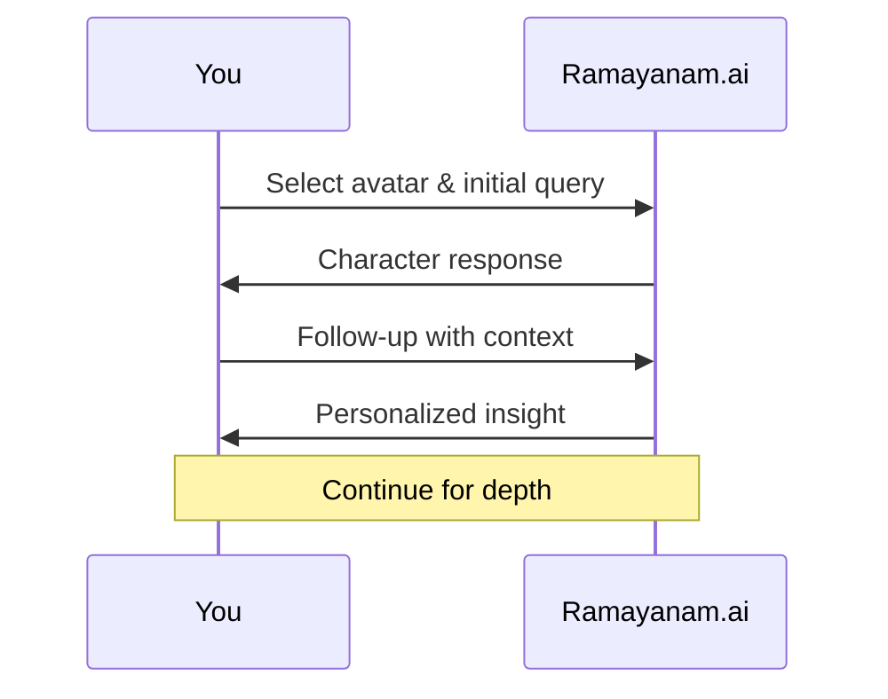

## Overview

Ramayanam.ai lets you engage in dynamic, AI-powered conversations that bring the epic's timeless wisdom to life. Chat with digital avatars of Rama, Sita, Hanuman, and others to explore stories, values, and moral dilemmas from the Ramayana. These interactions adapt to your questions, providing personalized insights rooted in traditional texts and modern AI.

Whether you're a student, devotee, or storyteller, start simple queries and guide discussions for profound revelations. Conversations support natural language, Sanskrit references, and contextual follow-ups.

## Starting and Guiding Dialogues

Begin interactions on the Ramayanam.ai dashboard at `https://dashboard.example.com/conversations`. Select an avatar like Lord Rama or Lakshmana, then type your first message.

<Steps>
  <Step title="Access the Chat" icon="terminal">
    Navigate to the conversations section.

    Log in with your account credentials.
  </Step>
  <Step title="Select Avatar" icon="users">
    Choose from avatars such as Rama, Hanuman, or Ravana.

    Each offers unique perspectives on the epic.
  </Step>
  <Step title="Initiate Dialogue" icon="message-circle">
    Type a greeting like `Tell me about your journey to Lanka.`

    The AI responds in character, maintaining narrative consistency.
  </Step>
  <Step title="Guide the Flow" icon="arrow-right">
    Follow up with `What values did you learn there?` to deepen the discussion.

    Use context from prior responses for coherent threads.
  </Step>
</Steps>

## Asking About Characters and Events

Pose targeted questions to uncover details. Use specific names and events for precise answers.

<Tabs>
  <Tab title="Characters" icon="user">
    Query individual personas and their arcs.

    ```text
    Who is Hanuman and what are his key strengths?
    ```

    ```text
    Describe Sita's role in the forest exile.
    ```

    Expected response draws from Valmiki Ramayana, highlighting devotion and resilience.
  </Tab>
  <Tab title="Events" icon="calendar">
    Explore pivotal moments.

    ```text
    Narrate the battle between Rama and Ravana.
    ```

    ```text
    What happened during the golden deer's episode?
    ```

    AI provides chronological summaries with moral lessons.
  </Tab>
</Tabs>

<Callout kind="tip">
  Prefix questions with `In the context of Uttara Kanda` for episode-specific depth.
</Callout>

## Personalizing for Deeper Insights

Tailor chats to your needs using context, language preferences, or themes.

<Columns cols={3}>
  <Card title="Set Context" icon="book-open" href="#personalize-context">
    Start with `As a modern parent, explain dharma from Rama's life.`

    Receives family-oriented interpretations.
  </Card>
  <Card title="Language Toggle" icon="globe" href="#personalize-language">
    Say `Respond in Sanskrit with English translation.`

    Blends tradition and accessibility.
  </Card>
  <Card title="Theme Focus" icon="heart" href="#personalize-theme">
    Request `Focus on bhakti from Hanuman's viewpoint.`

    Emphasizes devotion over action.
  </Card>
</Columns>

## Programmatic Conversations

Integrate AI chats into your apps via the API at `https://api.example.com/v1/chat`.

<CodeGroup tabs="JavaScript,Python">
  ```javascript
  const response = await fetch('https://api.example.com/v1/chat', {
    method: 'POST',
    headers: { 'Authorization': `Bearer ${YOUR_API_KEY}`, 'Content-Type': 'application/json' },
    body: JSON.stringify({
      avatar: 'hanuman',
      message: 'Tell me about your leap to Lanka.',
      context: 'Ramayana Yuddha Kanda'
    })
  });
  const data = await response.json();
  console.log(data.reply);
  ```
  ```python
  import requests

  response = requests.post(
      'https://api.example.com/v1/chat',
      headers={'Authorization': f'Bearer {YOUR_API_KEY}', 'Content-Type': 'application/json'},
      json={'avatar': 'hanuman', 'message': 'Tell me about your leap to Lanka.', 'context': 'Ramayana Yuddha Kanda'}
  )
  print(response.json()['reply'])
  ```
</CodeGroup>

<ParamField path="avatar" param-type="string" required="true">
  Avatar name like `rama` or `hanuman`.
</ParamField>

<ParamField body="message" param-type="string" required="true">
  Your query about Ramayana elements.
</ParamField>

<ParamField body="context" param-type="string" required="false">
  Optional episode or theme for focus.
</ParamField>

## Best Practices for Meaningful Interactions

<ExpandableGroup>
  <Expandable title="Avoid Vague Questions" default-open="true">
    Instead of `Tell me about Ramayana`, ask `How did Rama uphold dharma in exile?`.

    Vague inputs yield general overviews; specifics unlock nuanced wisdom.
  </Expandable>
  <Expandable title="Build on Responses">
    Reference prior answers: `Expanding on Rama's bow-breaking, what followed?`.

    Creates threaded, evolving dialogues.
  </Expandable>
  <Expandable title="Respect Cultural Depth">
    Acknowledge epic's sanctity: `With reverence, share insights on vanara sena loyalty.`

    Enhances respectful, immersive exchanges.
  </Expandable>
</ExpandableGroup>



Follow these steps to transform casual chats into profound explorations of Ramayana's eternal lessons. Experiment across avatars for multifaceted views.