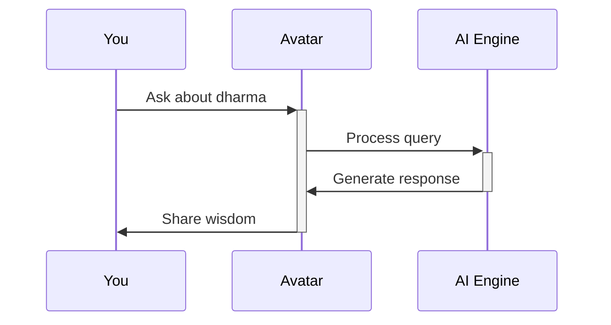

## Overview

Ramayanam.ai transforms the timeless Ramayana epic into an interactive AI experience. You engage with digital avatars of legendary characters like Rama, Sita, and Hanuman through conversations that reveal traditional values. Create episodes, reels, and stories, or explore pre-built content for personal reflection or education. The platform blends ancient wisdom with modern AI, making the epic accessible and engaging.

<Columns cols={3}>
  <Card title="Digital Avatars" icon="users" href="#digital-avatars">
    Interact with AI characters that respond intelligently to your questions.
  </Card>
  <Card title="Content Creation" icon="video" href="#content-creation">
    Build custom episodes, reels, and stories featuring Ramayana themes.
  </Card>
  <Card title="Traditional Values" icon="heart" href="#values">
    Discover dharma, loyalty, and courage through interactive storytelling.
  </Card>
</Columns>

## Digital Avatars and Character Interactions

Dive into conversations with AI-powered avatars that embody Ramayana characters. Ask Rama about leadership or Hanuman about devotion, and receive context-aware responses drawn from the epic's wisdom.

<Callout kind="tip">
  Start simple: Ask `{Who is Rama?}` to begin exploring character backstories.
</Callout>



Customize avatars for deeper engagement. Select voices, expressions, and scenarios to match your learning style.

<Expandable title="Advanced Avatar Customization" default-open="false">

Set parameters like language and tone via the dashboard.

```javascript
// Example avatar config
const avatarConfig = {
  character: "Rama",
  language: "English",
  tone: "inspirational",
  scenario: "forest exile"
};
```

</Expandable>

## Creating and Viewing Episodes, Reels, and Stories

Generate your own Ramayana-inspired content effortlessly.

<Steps>
  <Step title="Select Template" icon="layout">
    Choose from episode, reel, or story formats.
  </Step>
  <Step title="Add Characters" icon="users">
    Drag avatars like Sita or Lakshmana into scenes.
  </Step>
  <Step title="Script Dialogue" icon="edit-3">
    Use AI suggestions or write custom lines based on epic events.
  </Step>
  <Step title="Publish and Share" icon="share-2">
    Export as video or embed on your site.
  </Step>
</Steps>

View community content through categorized feeds. Filter by theme, like `{vanavasa}` or `{battle of Lanka}`.

<Tabs>
  <Tab title="Episodes" icon="play-circle">
    Full narrative arcs, 5-15 minutes long.
  </Tab>
  <Tab title="Reels" icon="maximize-2">
    Short clips under 60 seconds for quick insights.
  </Tab>
  <Tab title="Stories" icon="book-open">
    Interactive choose-your-own-adventure formats.
  </Tab>
</Tabs>

## Exploring Traditional Values via Modern Tech

Ramayanam.ai surfaces values like righteousness (`dharma`), devotion (`bhakti`), and courage through AI-driven analysis. Query how modern dilemmas align with epic lessons.

<Callout kind="info">
  AI ensures responses stay true to original texts while adapting to contemporary contexts.
</Callout>

## Use Cases for Engagement

<Tabs>
  <Tab title="Personal Growth" icon="heart">
    Reflect daily with avatar meditations on patience from Sita's story.
  </Tab>
  <Tab title="Educational" icon="book-open">
    Teachers assign group projects recreating Lanka war episodes.

    <CodeGroup tabs="Embed,API">
    ````html
    <!-- Embed player -->
    <iframe src="https://ramayanam.ai/embed/episode/123" width="600" height="400"></iframe>
    ````
    ```javascript
    // API call for content
    const response = await fetch('https://api.example.com/episodes/123');
    const episode = await response.json();
    ```
    </CodeGroup>

  </Tab>
</Tabs>

<Columns cols={2}>
  <Card title="Family Learning" icon="home" href="/quickstart">
    Gather for interactive story nights.
  </Card>
  <Card title="Cultural Workshops" icon="activity" href="/authentication">
    Host sessions exploring epic values.
  </Card>
</Columns>