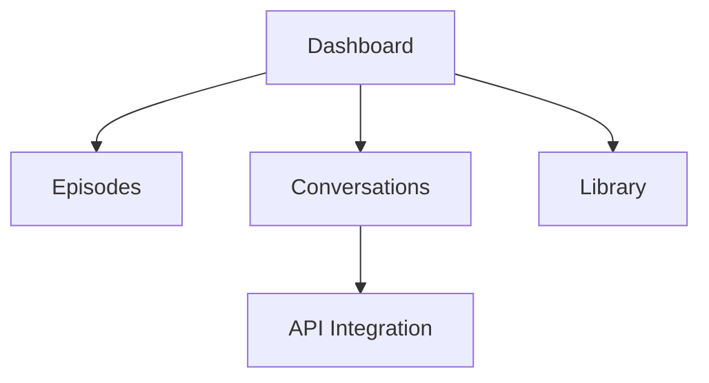

## Prerequisites

Before you begin, ensure you have:

- A modern web browser like Chrome, Firefox, or Safari
- An active email address for account verification
- Optional: The Ramayanam.ai mobile app from the App Store or Google Play for on-the-go access

<Callout kind="info">

No credit card required for the free tier. Upgrade later for premium avatars and unlimited conversations.
</Callout>

## Create Your Account

Follow these steps to sign up quickly.

<Steps>
  <Step title="Visit the Platform" icon="globe">
    Navigate to [https://ramayanam.ai](https://ramayanam.ai) and click **Sign Up** in the top right corner.
  </Step>
  <Step title="Enter Your Details" icon="user-plus">
    Provide your email, create a strong password, and select your preferred language (English or Hindi).
  </Step>
  <Step title="Verify Email" icon="mail">
    Check your inbox for a verification link from `no-reply@ramayanam.ai` and click it to activate your account.
  </Step>
</Steps>

## Log In and Access the Dashboard

Once verified, log in across platforms.

<Tabs>
  <Tab title="Web Browser" icon="globe">
    Go to [https://dashboard.ramayanam.ai](https://dashboard.ramayanam.ai), enter your credentials, and land on the personalized dashboard.
  </Tab>
  <Tab title="Mobile App" icon="smartphone">
    Open the Ramayanam.ai app, tap **Log In**, and scan the QR code from the web version or enter details manually.
  </Tab>
</Tabs>

<Callout kind="tip">

Enable two-factor authentication in **Settings > Security** for added protection.
</Callout>

## Explore Initial Content

Dive into episodes, reels, and stories right away.

<Steps>
  <Step title="Browse Episodes" icon="play-circle">
    From the dashboard, click **Episodes** to view AI-generated Ramayana chapters like "Rama's Exile".
  </Step>
  <Step title="Interact with Avatars" icon="bot">
    Select an avatar (e.g., Lord Rama) and start a conversation: "What is dharma?"
  </Step>
  <Step title="Save Favorites" icon="bookmark">
    Heart any story or reel to add it to your **Library** for later viewing.
  </Step>
</Steps>

## Navigate the User Interface

The dashboard organizes content intuitively.

<Columns cols={3}>
  <Card title="Content Library" icon="book-open" href="#explore-content">
    Access episodes, reels, and stories categorized by themes like valor and devotion.
  </Card>
  <Card title="AI Conversations" icon="message-circle" href="#chat">
    Chat with digital avatars for personalized wisdom from the Ramayana.
  </Card>
  <Card title="Settings" icon="settings" href="#profile">
    Manage account, preferences, and premium subscriptions.
  </Card>
</Columns>

## Try Your First AI Interaction via API

For developers, embed interactions using the REST API.

<CodeGroup tabs="JavaScript,cURL">
  ```javascript
  const response = await fetch('https://api.ramayanam.ai/v1/chat', {
    method: 'POST',
    headers: { 'Authorization': `Bearer YOUR_API_KEY`, 'Content-Type': 'application/json' },
    body: JSON.stringify({
      avatar: 'rama',
      message: 'Explain Sita\'s abduction'
    })
  });
  const data = await response.json();
  console.log(data.reply);
  ```
  ```bash
  curl -X POST https://api.ramayanam.ai/v1/chat \
    -H "Authorization: Bearer YOUR_API_KEY" \
    -H "Content-Type: application/json" \
    -d '{
      "avatar": "rama",
      "message": "Explain Sita'\''s abduction"
    }'
  ```
</CodeGroup>

<ParamField header="Authorization" param-type="string" required="true">
  Bearer token obtained from dashboard settings.
</ParamField>

## Next Steps

<Expandable title="Advanced Features" default-open="false">

Explore premium avatars or integrate with your app.


</Expandable>

<Card title="Introduction" icon="book" href="/introduction">
  Learn core concepts and timeless values.
</Card>

<Card title="Authentication" icon="shield" href="/authentication">
  Secure your API access and tokens.
</Card>

<Card title="Changelog" icon="git-branch" href="/changelog">
  Stay updated with new episodes and features.
</Card>